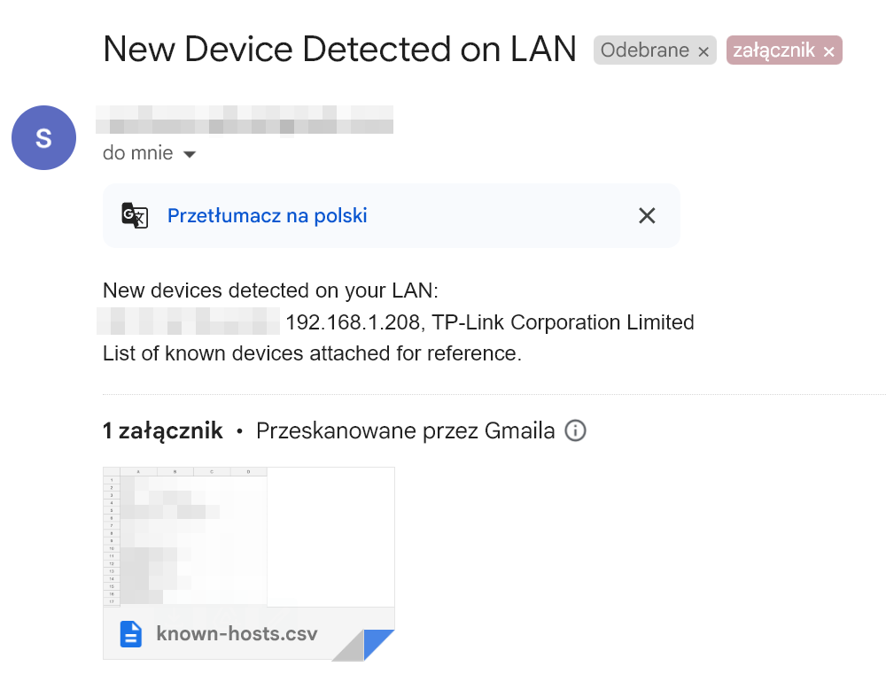
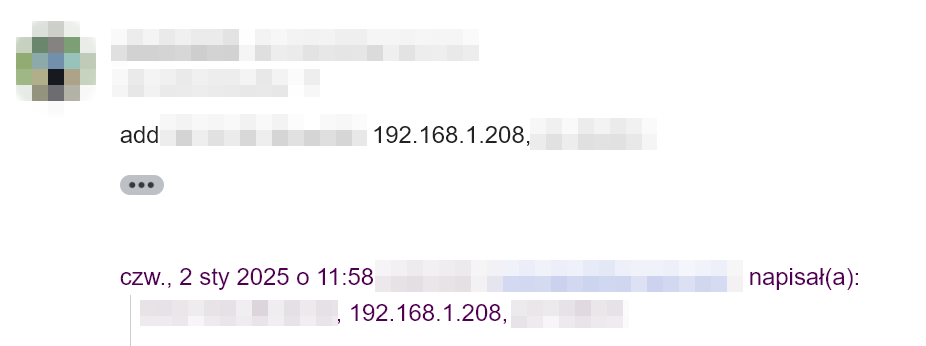

# MAC Intruder Detection

This script scans your local network for new devices and sends notifications via email when new devices are detected. It uses `arp-scan` to detect devices and integrates with Gmail for sending notifications.

## Here's how it works

1. Your script runs on your local server (connected to your LAN) and it detects a device which is not known (not in knows-hosts.csv file)

2. You recevie an email with the information of the unknown device with know-hosts.csv as attachement


   
3. You can add this device to your know-hosts.csv by replying `add <mac_address>`, ex `add 66:33:77:6e:11:00`



4. Next time your script runs it scans the inbox for your reply and the new device(s)

## Features

- Scans the local network for devices using `arp-scan`.
- Sends email notifications when new devices are detected.
- Configurable via environment variables.
- Maintains a list of known devices and the last time they were notified.
- Newly dectected devices can be added as reply to notification email
- Email checks intervals are configurable

## Installation

### Prerequisites

- Python 3.6+
- `arp-scan` tool
- Gmail account for sending notifications

### Install arp-scan

```sh
sudo apt update
sudo apt install arp-scan
```

Make sure you can run arp-scan


```sh
sudo arp-scan -l
```

Example output:
```
Interface: eth0, type: EN10MB, MAC: cc:cc:66:88:33:a2, IPv4: 192.168.1.178
Starting arp-scan 1.10.0 with 256 hosts (https://github.com/royhills/arp-scan)
192.168.1.1     99:31:33:22:11:b4       ASUSTek COMPUTER INC.
192.168.1.170   34:86:5d:ca:55:88       Espressif Inc.
192.168.1.212   66:33:77:6e:11:00       Dyson Limited

3 packets received by filter, 0 packets dropped by kernel
Ending arp-scan 1.10.0: 256 hosts scanned in 2.070 seconds (123.67 hosts/sec). 3 responded
```

### Clone the Repository

```sh
git clone https://github.com/yourusername/mac-intruder.git
cd mac-intruder
```

### Set Up Virtual Environment

```sh
python3 -m venv venv
source venv/bin/activate
pip install -r requirements.txt
```

### Configure Environment Variables

Create a `.env` file in the root directory and add environment variables, ex:

```env
KNOWN_HOSTS=known-hosts.csv
LAST_NOTIFIED_FILE=last_notified.json
EMAIL_CHECK_FILE=last_email_checked.txt
EMAIL_CHECK_INTERVAL=21600
EMAIL_USERNAME=your_email@gmail.com
EMAIL_PASSWORD=your_app_password
EMAIL_RECEPIENT=recepient_email@gmail.com
```

## Usage

### Add Script to Crontab

To run the script every 15 minutes, add the following entry to your crontab:

```sh
crontab -e
```

Add cron entry. Example:
```sh
*/15 * * * * cd ~/mac-intruder && .direnv/python-3.11.2/bin/python main.py >> output.log 2>&1
```

### Example Output Log

```
2025-01-02 12:00:23,621 - __main__ - Starting mac-intruder scan
2025-01-02 12:00:23,621 - mac_intruder.mac_intruder - Scanning local network...
2025-01-02 12:00:25,729 - mac_intruder.mac_intruder - MAC 00:33:77:6e:11:00 not in known hosts.
2025-01-02 12:00:25,729 - mac_intruder.mac_intruder - No new devices detected.
2025-01-02 12:00:27,753 - mac_intruder.gmail - Checking 1 messages for new known host.
2025-01-02 12:00:28,629 - mac_intruder.mac_intruder - Adding new devices: ['00:33:77:6e:11:00']
2025-01-02 12:00:28,630 - __main__ - mac-intruder scan ended successfully
```

## License

This project is licensed under the MIT License - see the [LICENSE](LICENSE) file for details.
